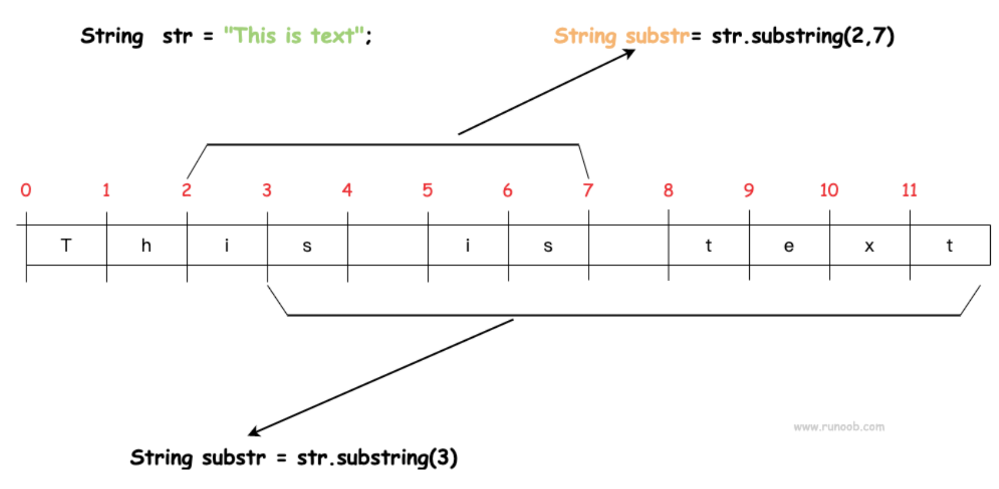

字符串方法
==========

.substring(int beginIndex)

或者

.substring(int beginIndex, int endIndex)

- 返回字符串的子字符串。
- beginIndex: 起始索引（包括），最小值为0
- endIndex: 结束索引（不包括），最大值为.length()

.indexOf(String str)

- 返回str在原String中第一次出现的index

- 当元素不存在时，返回-1

.equals(String y)

- 比较两个String是否相等
- 永远不要在AP考试中使用==符号比较两个String，只使用.equals()

.compareTo(String y)

- 比较两个String的大小
- 返回值是int类型，不是boolean类型